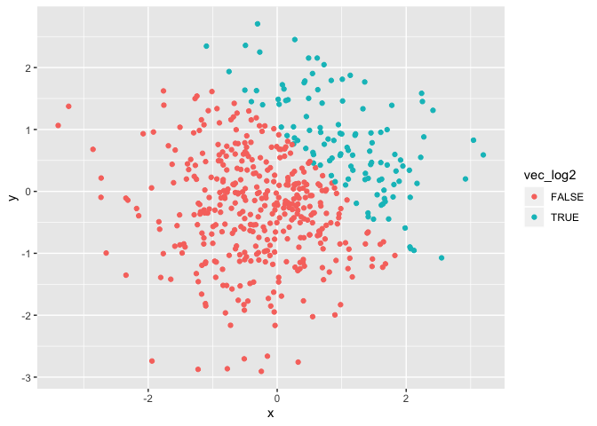
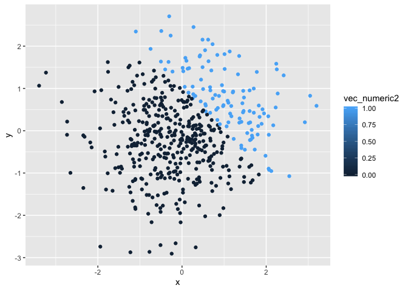
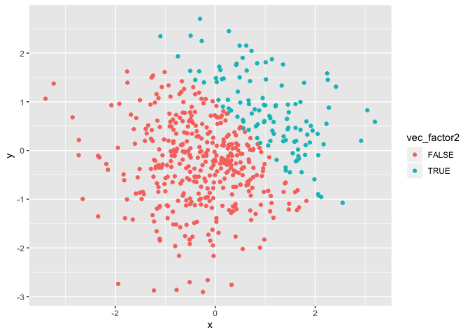

p8105\_hw1\_rac2224
================
Rachel Crowley
9/19/2019

Problem 1

creating
    dataframe

``` r
library(tidyverse)
```

    ## ── Attaching packages ───────────────────────────────────────── tidyverse 1.2.1 ──

    ## ✔ ggplot2 3.2.1     ✔ purrr   0.3.2
    ## ✔ tibble  2.1.3     ✔ dplyr   0.8.3
    ## ✔ tidyr   0.8.3     ✔ stringr 1.4.0
    ## ✔ readr   1.3.1     ✔ forcats 0.4.0

    ## ── Conflicts ──────────────────────────────────────────── tidyverse_conflicts() ──
    ## ✖ dplyr::filter() masks stats::filter()
    ## ✖ dplyr::lag()    masks stats::lag()

``` r
hw1_df = tibble(
  norm_samp = rnorm(8),
  norm_samp_log = norm_samp > 0,
  vec_char = c("one","two","three","four","five","six", "seven","eight"),
  vec_factor = factor(c("cat", "dog", "bird", "cat","dog","bird", "cat", "dog"))
)
```

Taking the mean of each variable

``` r
mean(pull(hw1_df, norm_samp))
```

    ## [1] -0.1176031

A mean was calculated for
    norm\_samp

``` r
mean(pull(hw1_df,vec_char))
```

    ## Warning in mean.default(pull(hw1_df, vec_char)): argument is not numeric or
    ## logical: returning NA

    ## [1] NA

The following error message was recieved when the mean of character
vector, vec\_char, was requested: “argument is not numeric or logical:
returning NA\[1\] NA”. This occured because it is composed of character
variables and you cannot derive a
    mean.

``` r
mean(pull(hw1_df,vec_factor))
```

    ## Warning in mean.default(pull(hw1_df, vec_factor)): argument is not numeric
    ## or logical: returning NA

    ## [1] NA

The following error message was recieved when the mean of factor vector,
vec\_factor, was requested: “argument is not numeric or logical:
returning NA\[1\] NA”. This occured because it is composed of factor
variables and you cannot derive a mean.

``` r
mean(pull(hw1_df, norm_samp_log))
```

    ## [1] 0.5

A mean was calculated for the logical vector

``` r
as.numeric(pull(hw1_df,vec_char))
```

    ## Warning: NAs introduced by coercion

    ## [1] NA NA NA NA NA NA NA NA

Following message was recieved when making the character vector numeric:
NAs introduced by coercion\[1\] NA NA NA NA NA NA NA NA

``` r
as.numeric(pull(hw1_df,vec_factor))
```

    ## [1] 2 3 1 2 3 1 2 3

output: \[1\] 2 3 1 2 3 1 2 3

``` r
as.numeric(pull(hw1_df, norm_samp_log))
```

    ## [1] 1 0 0 1 0 0 1 1

output: \[1\] 0 1 1 0 1 1 1
    1

``` r
as.numeric(pull(hw1_df,norm_samp))
```

    ## [1]  0.3390395 -0.4593594 -1.1529356  0.5330883 -1.1479199 -0.2116722
    ## [7]  0.1138060  1.0451286

vec\_factor, norm\_samp\_log, and norm\_samp could all be converted to a
numeric variable. vec\_char, the character vector, could not be
converted to numeric, which explains why a mean was not calculated.

Converting the logical
    vector

``` r
as.numeric(pull(hw1_df,norm_samp_log)) * (pull(hw1_df,norm_samp))
```

    ## [1] 0.3390395 0.0000000 0.0000000 0.5330883 0.0000000 0.0000000 0.1138060
    ## [8] 1.0451286

``` r
as.factor(pull(hw1_df,norm_samp_log)) * (pull(hw1_df,norm_samp))
```

    ## Warning in Ops.factor(as.factor(pull(hw1_df, norm_samp_log)),
    ## (pull(hw1_df, : '*' not meaningful for factors

    ## [1] NA NA NA NA NA NA NA NA

``` r
as.numeric(as.factor(pull(hw1_df,norm_samp_log)))*(pull(hw1_df,norm_samp))
```

    ## [1]  0.6780791 -0.4593594 -1.1529356  1.0661766 -1.1479199 -0.2116722
    ## [7]  0.2276120  2.0902571

Problem 2

``` r
set.seed(1234)

plot_df2 = tibble(
  x = rnorm(500),
  y = rnorm(500),
  vec_log2 = x + y >1,
  vec_numeric2 = as.numeric(vec_log2), 
  vec_factor2 = as.factor(vec_log2)
)
```

  - The size of the dataset is 500 rows and 5 columns
  - The mean is 0.0018388, the median is -0.0207073, and the standard
    deviation is 1.0348139
  - The proportion of cases for which x + y \> 1 is 0.232

Scatterplot of y vs x

``` r
ggplot(plot_df2, aes(x=x, y=y, color = vec_log2)) + geom_point()
```

<!-- -->

``` r
ggsave("plot_df2.png")
```

    ## Saving 7 x 5 in image

``` r
ggplot(plot_df2, aes(x=x, y=y, color = vec_numeric2)) + geom_point()
```

<!-- -->

``` r
ggplot(plot_df2, aes(x=x, y=y, color = vec_factor2)) + geom_point()
```

<!-- -->

Within the first plot that colors points using the logic variable, the
color scale consists of two colors that represent the binary of true
versus false. Red equals false and blue equals true. Similarly, within
the third plot that colors points using the factor variable the color
scale consists of two colors that represent the binary of true versus
false. Red equals false and blue equals true. Within the second plot
that colors points using the numeric variable, the color scale is a
gradient that includes colors from dark blue to light blue, which
represents a continuous scale from 0.00 to 1.00 respectively.
